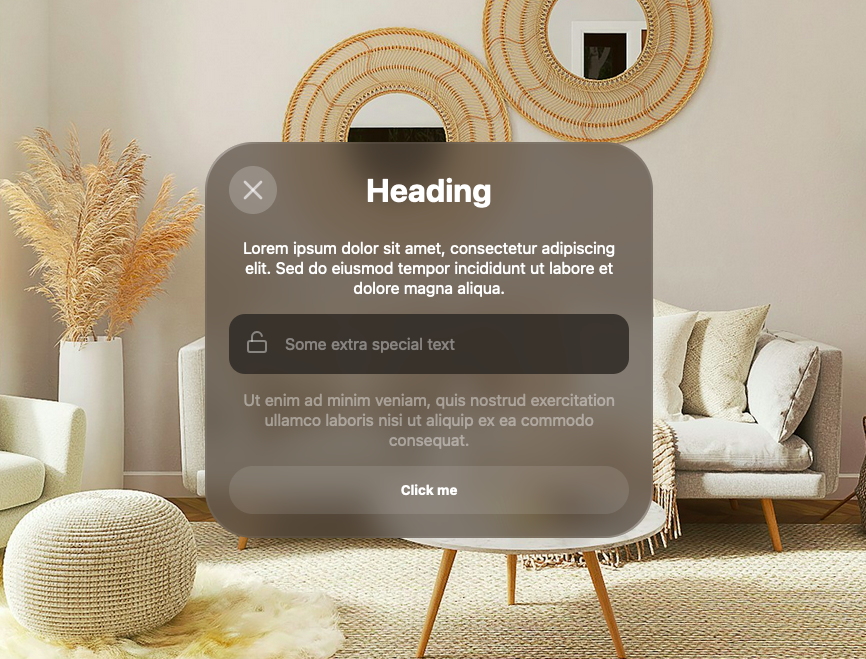

# Vision CSS
A CSS recreation of the Apple VisionOS window UI, featuring frosted glass effects and corner flares.



## Features

- Frosted glass effect using backdrop-filter blur
- Gradient borders using SVG border-image
- Pure CSS implementation

## Usage

1. Include the CSS file in your HTML:

```html
  <link rel="stylesheet" href="vision.css">
```

2. Create a `div` with a `card` class.

```html
  <div class="card">
    Card content
  </div>
```

3. Add optional inner elements

Additional classes:
- `.inner-card`
- `.card-header`
  - `.card-button`
  - `.card-heading`
- `.btn`

## License
- The code is licensed under the MIT license and can be used and modified freely.
- The background image is licensed under the [Unsplash license](https://unsplash.com/license).

